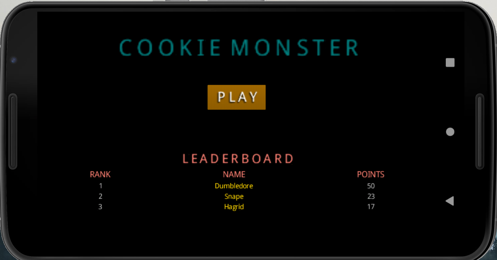
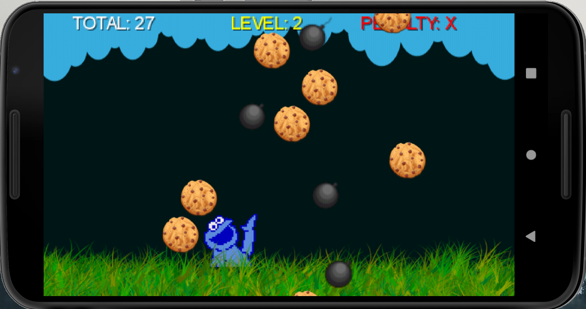
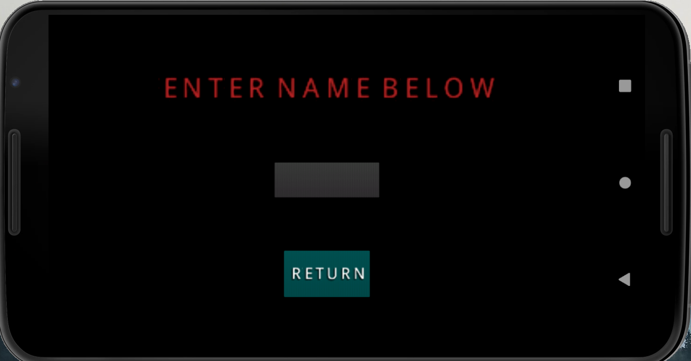

# CS 441 Project 6
## <ins>COOKIE MONSTER GAME</ins>

### <ins>UPDATES</ins>
Web access functioning added: The highscore of the game is uploaded to the class database online. Also, scores from other games are downloaded from the server to be displayed on the gamescreen. 

### <ins>DESCRIPTION:</ins>
This simple game consists of two screens: Main Menu and Game screens. The game begins with the main menu screen which displays the 'START' button and the accumulated 'HIGH SCORE'. Clicking on the screen will change to the 'Game' screen, which consists of a cookie monster at the bottom of the screen and animated 'Cookie' and 'Bomb' objects falling vertically. The objective of the game is to feed the cookie monster as many cookies as possible while avoiding the bombs.

### <ins>HOW TO PLAY:</ins> 
Upgrade level every ten points coolected. ***Every three penalties results in game over***. Levels 0-1 are easy, levels 2-3 are medium, while levels 4-5 are considered hard. Read the levels' description below:

***Points are gained by collecting cookies and avoiding bombs. No points are lost if a cookie is missed. Penalty is given if a bomb is collected***:

---**Level 0** (pts. 0-10): Cookies falling vertically at a slow pace.

---**Level 1** (pts. 11-20): Cookies and bombs falling vertically at a slow pace.

---**Level 2** (pts. 21-30): Cookies falling at a medium pace while bombs still fall at a slow pace. Increased amount of both.

---**Level 3** (pts. 31-40): Cookies and bombs falling vertically at a high speed.

***Points are gained by avoiding bombs. No points are lost if a bomb is collected. Penalty is given if a bomb is collected***:

---**Level 4** (pts. 41-50): Only an increased amount of bombs falling vertically at a high speed.

***Points are gained by collecting cookies. No points are lost if a cookie is missed. Penalty is given if a cookie is missed***:

---**Level >5** (pts. 51- ): Only an increased amount of cookies falling vertically at a high speed. 

**STEP 1**: Click the start button to begin:

**STEP 2**: Control the 'Cookie Monster' object with the keyboard keys: left or right, or by touching the screen to feed it as many cookies as possible. Avoid bombs:

**STEP 3**: View your highest score on the main menu after game over, and play again to beat your score. (Game is over after 3 penalties): 

